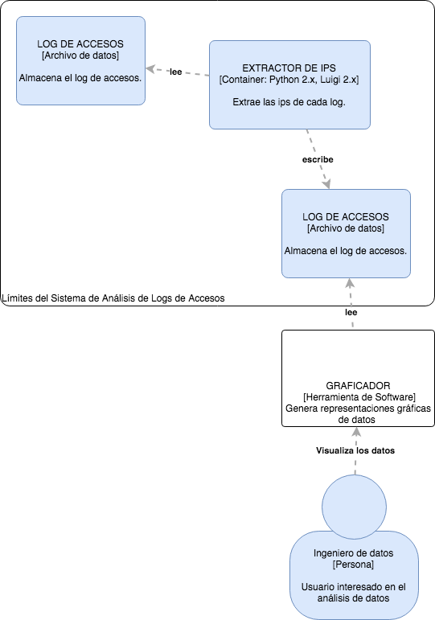

# Arquitecturas Batch - Sequential

## Tarea 3

### Prerequisitos

Antes de ejecutar el código de la tarea 3 se requiere instales las librerias de Python indicadas en el archivo [requirements.txt]

### Ejecutar simulador de logs

En la linea de comandos ejecutar la siguiente instrucción:
        $ python apache-fake-log-gen.py -n 1000 -o LOG

El cual les creara un archivo con la cantidad de LOGS especificado (-n).

### Ejecutar batch sequential

La tarea 3 Batch-Sequential se ejecuta de la siguiente manera.
1. Abrir terminal.
2. Instalar las dependencias 'pip install -r requirements.txt'
3. Ejecutar el script 'python apache-fake-log-gen.py -n 1000 -o LOG'
4. Verificar si el archivo se haya generado
5. Mover el archivo a la carpeta archivos
6. Ejecutar el script 'python ExtractorLogs.py'

A continuación se muestra un diagrama de contenedores del SALA.

## Versión

1.0.0 - Mayo 8 2017

## Autores

* **Perla Velasco**
* **Jared Daniel Salinas**